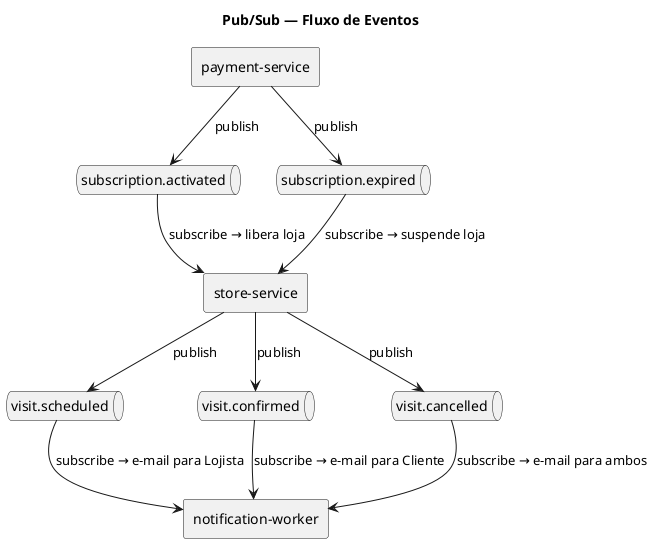

# Pub/Sub — Sistema de Eventos Assíncronos

## Contexto

O MVP utiliza comunicação síncrona (REST). O Pub/Sub é introduzido na **Fase 4 (Notificações)** para desacoplar ações que não precisam de resposta imediata: notificações de visitas, expiração de assinaturas e upload de mídia.

## Tecnologia

**Redis Pub/Sub** (ou **RabbitMQ** como alternativa mais robusta).

- Redis: já disponível como dependência do Docker Compose, simples de configurar.
- RabbitMQ: preferível quando há necessidade de persistência de mensagens e dead-letter queue.

```
┌──────────────────────────────────────────────┐
│               Docker network                  │
│                                              │
│  store-service ──publish──► Redis ──subscribe──► notification-worker │
│  payment-service ──publish──►  │                                     │
│                                └──subscribe──► store-service         │
└──────────────────────────────────────────────┘
```

---

## Eventos Definidos

### Canal: `visit.scheduled`

**Publicado por**: `store-service`
**Consumido por**: `notification-worker` (ou stub no próprio store-service)
**Quando**: Um Cliente cria uma visita com status `PENDING`.

```json
{
  "event": "visit.scheduled",
  "payload": {
    "visitId": "uuid",
    "clientId": "uuid",
    "clientEmail": "cliente@email.com",
    "productId": "uuid",
    "productName": "Ferrari 488",
    "storeId": "uuid",
    "lojistaEmail": "lojista@email.com",
    "scheduledAt": "2026-05-10T14:00:00Z"
  }
}
```

**Ação do consumidor**: Enviar e-mail para o Lojista informando nova solicitação de visita.

---

### Canal: `visit.confirmed`

**Publicado por**: `store-service`
**Consumido por**: `notification-worker`
**Quando**: Lojista confirma uma visita.

```json
{
  "event": "visit.confirmed",
  "payload": {
    "visitId": "uuid",
    "clientEmail": "cliente@email.com",
    "productName": "Apartamento Luxo 200m²",
    "scheduledAt": "2026-05-10T14:00:00Z",
    "storeAddress": "Rua das Flores, 123"
  }
}
```

**Ação do consumidor**: Enviar e-mail para o Cliente com confirmação e detalhes da visita.

---

### Canal: `visit.cancelled`

**Publicado por**: `store-service`
**Consumido por**: `notification-worker`
**Quando**: Qualquer uma das partes cancela a visita.

```json
{
  "event": "visit.cancelled",
  "payload": {
    "visitId": "uuid",
    "cancelledBy": "LOJISTA | CLIENTE",
    "clientEmail": "cliente@email.com",
    "lojistaEmail": "lojista@email.com",
    "productName": "Ferrari 488"
  }
}
```

---

### Canal: `subscription.activated`

**Publicado por**: `payment-service`
**Consumido por**: `store-service`
**Quando**: Webhook do Stripe `checkout.session.completed` é processado com sucesso.

```json
{
  "event": "subscription.activated",
  "payload": {
    "lojistaId": "uuid",
    "planId": "uuid",
    "expiresAt": "2027-04-28T00:00:00Z"
  }
}
```

**Ação do consumidor**: `store-service` libera flag de "loja publicável" para o Lojista.

---

### Canal: `subscription.expired`

**Publicado por**: `payment-service` (job agendado ou webhook `customer.subscription.deleted`)
**Consumido por**: `store-service`
**Quando**: Assinatura expira ou é cancelada.

```json
{
  "event": "subscription.expired",
  "payload": {
    "lojistaId": "uuid"
  }
}
```

**Ação do consumidor**: `store-service` suspende lojas do Lojista.

---

## Diagrama de Eventos (PlantUML)



---

## Implementação com Redis (Node.js)

### Publisher (store-service)

```typescript
import { createClient } from 'redis';

const publisher = createClient({ url: process.env.REDIS_URL });
await publisher.connect();

await publisher.publish('visit.scheduled', JSON.stringify({
  event: 'visit.scheduled',
  payload: { visitId, clientId, ... }
}));
```

### Subscriber (notification-worker)

```typescript
import { createClient } from 'redis';

const subscriber = createClient({ url: process.env.REDIS_URL });
await subscriber.connect();

await subscriber.subscribe('visit.scheduled', (message) => {
  const { payload } = JSON.parse(message);
  sendEmail(payload.lojistaEmail, 'Nova visita agendada', payload);
});
```

---

## Configuração Docker (Redis)

Adicionar ao `docker-compose.yml`:

```yaml
redis:
  image: redis:7-alpine
  ports:
    - "6379:6379"
  volumes:
    - redis_data:/data
  healthcheck:
    test: ["CMD", "redis-cli", "ping"]
    interval: 10s
    timeout: 5s
    retries: 5
```

Variável de ambiente nos serviços:
```
REDIS_URL=redis://redis:6379
```
